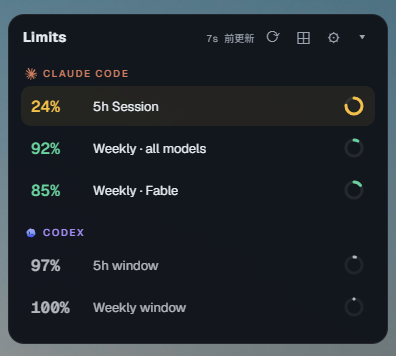
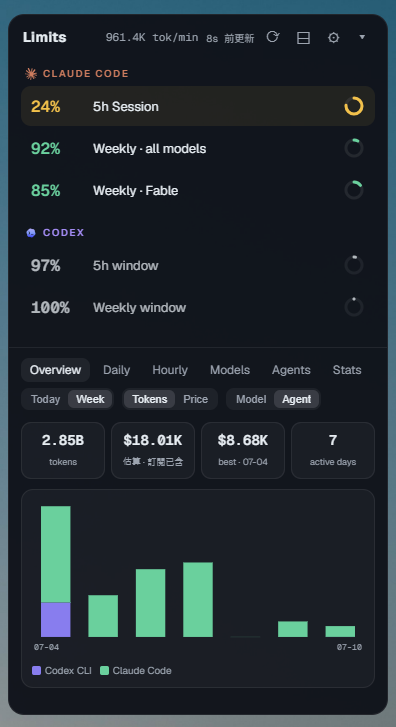
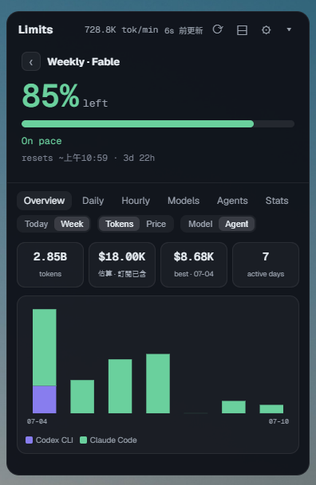
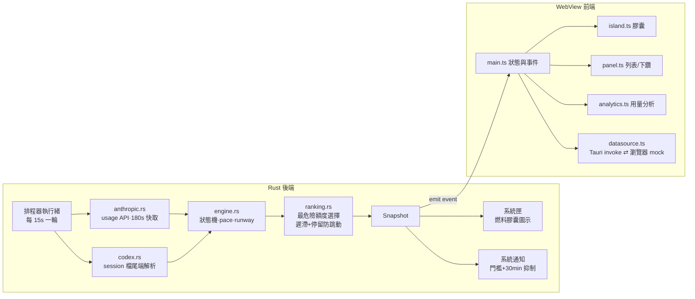

<div align="center">

# TokenBar

**你的 AI coding 額度油表 —— 常駐桌面，一眼看懂 Claude Code 和 Codex 還剩多少油。**


*就是這顆小膠囊。左邊 Claude、右邊 Codex，加上現在的燒速。*

</div>

---

## 為什麼需要它？

如果你同時用 Claude Code 和 Codex 寫程式，一定遇過這些情況：

- 寫到一半突然被告知 **5 小時額度用完了**，工作被迫中斷。
- 想知道還剩多少額度，得跑去翻官網或輸入指令查詢，**查一次要好幾步**。
- 週限額默默燒完，最需要 AI 的時候反而不能用。

TokenBar 把這件事變成**看一眼就好**：一顆常駐在螢幕右下角的小膠囊，像汽車油表一樣顯示兩家的剩餘額度。快用完會變黃、鎖定會閃紅、到達警戒線還會跳系統通知。

## 一眼看懂

| 島嶼膠囊（常駐） | 精簡面板 | 完整面板 | 額度詳情 |
|:---:|:---:|:---:|:---:|
|  |  |  |  |
| 兩家剩餘 % + 燒速 | 只看額度列表 | 加上用量分析 | 單一額度下鑽 |

- **島嶼膠囊**：Claude（橘色星芒）與 Codex（藍紫雲朵）各顯示「該家最危險的一條額度」的剩餘 %，右側是今日平均燒速。顏色會說話——綠色安全、黃色接近上限、紅色閃爍表示已鎖定。
- **點一下展開面板**：列出所有額度（Claude 5h／週／Fable 專屬週限、Codex 5h／週），每條都能點進去看「還剩幾 %、燒太快還是正常、預計多久燒完、什麼時候重置」。
- **用量分析**：今日/本週的 token 用量、估算花費、逐日/逐時分佈、模型與工具佔比。
- **精簡模式**：不想看分析？header 一鍵切換，只留額度列表，視窗自動變小。

## 安裝

到 [Releases](../../releases) 下載，或自行打包（見下方開發指南）：

| 方式 | 檔案 | 說明 |
|---|---|---|
| 安裝版（推薦） | `TokenBar_x64-setup.exe` | NSIS 安裝精靈 |
| MSI | `TokenBar_x64_en-US.msi` | 企業部署用 |
| 免安裝 | `tokenbar.exe` | 直接執行，約 28MB RAM |

> 目前僅支援 Windows。需要本機已登入 Claude Code（讀取 `~/.claude/.credentials.json`）與/或跑過 Codex CLI（讀取 `~/.codex/sessions/`）。

## 使用方式

| 操作 | 效果 |
|---|---|
| 點擊島嶼 | 展開完整面板（從右下角向上長出） |
| 拖曳島嶼 | 移動位置，靠近螢幕邊緣自動吸附 |
| 點擊額度列 | 下鑽該額度的詳情（pace／runway／重置時間） |
| `⟳` | 立即更新（繞過快取直接查詢） |
| `⊟` / `⊞` | 精簡模式 ⇄ 完整模式 |
| `⚙` | 設定（見下表） |
| 系統匣圖示 | 燃料膠囊縮圖 + hover 顯示所有額度；右鍵可顯示/隱藏/結束 |

### 設定項

| 設定 | 預設 | 說明 |
|---|---|---|
| 開機自動啟動 | 關 | 登入 Windows 後自動常駐 |
| 允許 Claude 權杖更新 | 關 | **opt-in**：token 過期時自動換新。不開啟則過期時顯示「估算」降級狀態 |
| 警戒 / 危險門檻 | 75% / 90% | 用量到達門檻時發系統通知（同一額度 30 分鐘內不重複吵你） |
| 島嶼顯示 | 並排 | Claude + Codex 並排／僅 Claude／僅 Codex |

完整參數表（更新頻率、狀態機門檻等）見 [docs/CONFIG.md](docs/CONFIG.md)。

## 資料來源與隱私

TokenBar **不需要你額外登入任何帳號**，它直接利用你本機已有的資料：

| 來源 | 方式 | 更新頻率 |
|---|---|---|
| Claude Code | 用本機 OAuth token 呼叫官方 usage API（唯讀） | 最快每 3 分鐘（手動 ⟳ 可立即） |
| Codex | 讀本機 session 檔尾端的 `rate_limits` 快照（純本機，無網路） | 每 15 秒重讀；資料只在 Codex 執行時更新 |

隱私與安全設計：

- **token 絕不落地**：憑證只在記憶體使用，任何情況不寫 log、不回顯。
- Claude 的 usage 查詢是唯讀的，不會動到你的登入狀態；會輪替 token 的 refresh 流程預設關閉、需在設定中自行開啟（已實作原子寫回，實測不影響 Claude Code 登入）。
- 沒有遙測、沒有第三方伺服器，你的用量數據不會離開這台電腦。

## 技術架構

Tauri 2（Rust 後端 + WebView 前端）+ vanilla TypeScript，無前端框架、無執行期 CDN 依賴，打包後安裝檔不到 3MB。



幾個值得一提的設計決策：

- **誠實的資料語意**：Codex 快照過期（視窗已重置）就顯示 0% + Idle；檔案太舊但視窗還沒到期，就保留最後已知值並標示 Stale——寧可告訴你「這是舊資料」也不猜。
- **來源掛了不變空白**：Claude API 失敗時降級成「估算」狀態，UI 永遠有東西可看（七態狀態機：Normal / Near / Locked / Stale / Idle / InsufficientData / SourceFailed）。
- **防跳動**：島嶼上顯示的「最危險額度」有 5% 遲滯 + 45 秒最短停留，不會兩條額度輪流閃來閃去。
- **模式鎖定高度**：視窗尺寸只在切換顯示模式時調整一次，切分頁、每秒倒數都不會觸發 OS resize，零卡頓。
- **瀏覽器 mock 模式**：不在 Tauri 環境時自動改用假資料（可切 safe/near/locked/degraded/stale 情境），UI 開發不需要跑 Rust。

### 專案結構

```
src/                前端（vanilla TS）
  island.ts         島嶼膠囊渲染
  panel.ts          額度列表 + 下鑽詳情
  analytics.ts      用量分析（六個分頁）
  datasource.ts     資料層抽象（Tauri ⇄ mock）
  engine 相關型別    types.ts / format.ts / colors.ts
src-tauri/src/      後端（Rust）
  lib.rs            入口：視窗、系統匣、排程器、通知
  providers/        anthropic.rs（usage API）、codex.rs（本機檔案）
  engine.rs         取樣歷史 → 狀態/pace/runway
  burnrate.rs       燒速斜率與 runway 投影
  ranking.rs        最危險額度選擇（遲滯防抖）
  analytics.rs      本機 jsonl 用量統計
  config.rs         settings.json 讀寫
docs/               UX 規格書、資料來源實測、參數總表（CONFIG.md）
```

## 開發

```bash
npm install                                    # 前端依賴
npm run tauri dev                              # 開發模式（TOKENBAR_DEBUG=1 可看每輪數值）
npm run dev                                    # 純前端 mock 模式（瀏覽器 http://localhost:1420）
cargo test --manifest-path src-tauri/Cargo.toml  # 後端測試
npm run tauri build                            # 打包（產物在 src-tauri/target/release/bundle/）
```

行為規格的唯一真相是 [docs/TokenBar UX Spec v3.md](docs/TokenBar%20UX%20Spec%20v3.md)，資料層實測見 [docs/data-sources-findings.md](docs/data-sources-findings.md)。

## 致謝

- 品牌 icon 來自 [lobehub/lobe-icons](https://github.com/lobehub/lobe-icons)（MIT），vendor 於 `src/assets/`
- 字體：[Geist / Geist Mono](https://vercel.com/font)（Vercel, OFL）
- 框架：[Tauri 2](https://tauri.app/)

> ⚠️ 本工具與 Anthropic、OpenAI 均無隸屬關係。Claude usage API 為未文件化端點，行為可能隨官方調整而變動。
