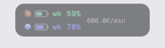
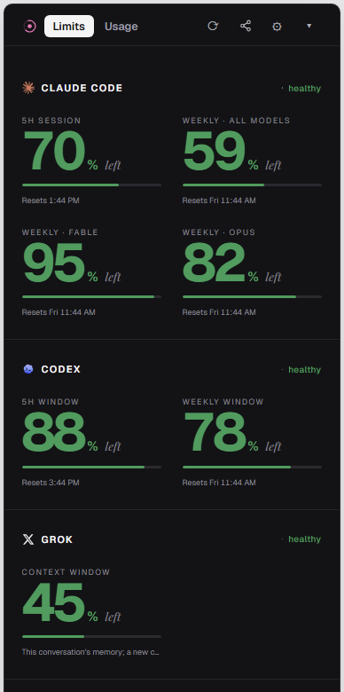
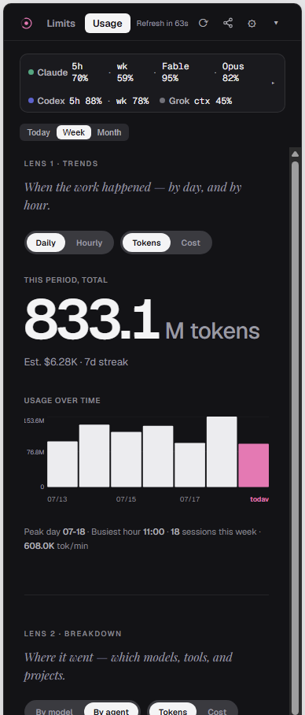
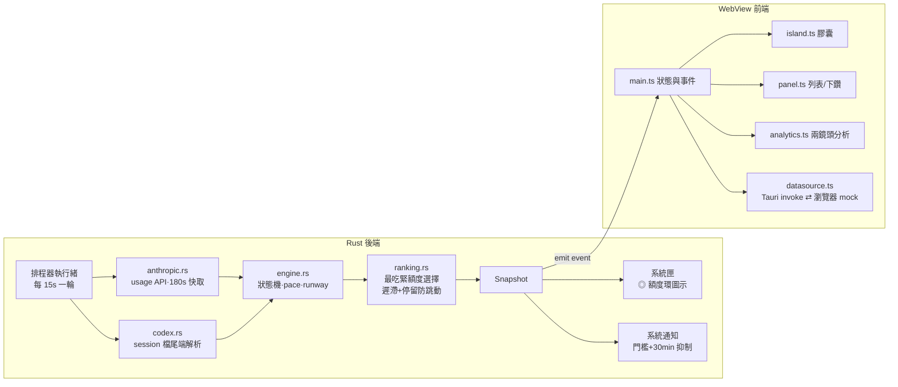

<div align="center">

# Atoll

**AI coding 額度的 runway 儀表 —— 常駐桌面，一眼看懂 Claude Code、Codex 還剩多少可用。**



*就這顆小膠囊。左邊 Claude、右邊 Codex，右側是現在的燒速。*

</div>

---

## 為什麼需要它

同時用 Claude Code 和 Codex 寫程式，大概都撞過這幾件事：

- 寫到一半被擋，才發現 5 小時額度已經見底。
- 想知道還剩多少，得跑去翻官網或敲指令，查一次好幾步。
- 週限額不知不覺燒完，偏偏在最需要 AI 的時候用不了。

Atoll 把它變成看一眼的事。螢幕角落一顆常駐膠囊，像手機電量一樣顯示兩家的剩餘額度；快用完轉黃、鎖定閃紅、過警戒線還會跳系統通知。名字取自環礁（atoll），品牌記號就是那圈額度環 ◎，跟膠囊裡的剩餘量呼應。

## 一眼看懂

| 島嶼膠囊（常駐） | 額度面板 | 用量 · 兩鏡頭 |
|:---:|:---:|:---:|
|  |  |  |
| 兩家剩餘 % + 燒速 | 每條額度的狀態與重置時間 | Trends 趨勢 / Breakdown 分佈 |

- **島嶼膠囊**：Claude（橘色星芒）與 Codex（藍紫雲朵）各顯示「這家最吃緊的那條額度」的剩餘 %，右側是今日平均燒速。顏色會講話：綠色安全、黃色接近上限、紅色閃爍代表鎖定。
- **點一下展開額度面板**：列出所有額度（Claude 5h／週／Fable 週限、Codex 5h／週，還有 Grok 的 context 佔用），每條點進去看剩幾 %、燒太快還是正常、預估多久見底、什麼時候重置。
- **用量分析收成兩個鏡頭**。Trends 看時間走勢——日或時、token 或花費，一鍵切換；Breakdown 看去向——哪個模型、哪個工具、哪個專案吃掉最多，加上 input／cached／output／reasoning 的組成。兩個鏡頭上下堆疊，一路捲就看完，不用在分頁之間跳。
- **亮暗雙主題**：預設跟隨系統，也能在設定裡固定亮或暗。

## 安裝

到 [Releases](../../releases) 下載，或自己打包（見下方開發）：

| 方式 | 檔案 | 說明 |
|---|---|---|
| 安裝版（推薦） | `Atoll_x64-setup.exe` | NSIS 安裝精靈 |
| MSI | `Atoll_x64_en-US.msi` | 企業部署用 |
| 免安裝 | `Atoll-portable.exe` | 直接執行 |

從 0.8.0 起就用 Atoll 這個身分打包，新版會就地升級舊版，不必先手動移除。更早的 TokenBar 版本因為換了 identifier，會和 Atoll 並存，留著或自行移掉都行。

> 目前只支援 Windows。需要本機已登入 Claude Code（讀 `~/.claude/.credentials.json`），以及／或跑過 Codex CLI（讀 `~/.codex/sessions/`）。

## 使用方式

| 操作 | 效果 |
|---|---|
| 點擊島嶼 | 展開完整面板 |
| 拖曳島嶼 | 移動位置，靠近邊緣會自動吸附 |
| 點擊額度列 | 下鑽該額度詳情（pace／runway／重置時間） |
| `⟳` | 立即更新（繞過快取直接查） |
| header 切換鈕 | 精簡模式 ⇄ 完整模式 |
| `⚙` | 設定（見下表） |
| 系統匣圖示 | ◎ 額度環縮圖，hover 顯示所有額度；右鍵可顯示／隱藏／結束 |

### 設定項

| 設定 | 預設 | 說明 |
|---|---|---|
| 主題 | 跟隨系統 | 亮／暗／跟隨系統 |
| 開機自動啟動 | 關 | 登入 Windows 後自動常駐 |
| 允許 Claude 權杖更新 | 關 | opt-in：token 過期時自動換新。不開的話，過期就顯示「估算」的降級狀態 |
| 警戒／危險門檻 | 75%／90% | 用量到門檻發系統通知，同一額度 30 分鐘內不重複吵你 |
| 島嶼顯示 | 並排 | Claude + Codex 並排／只看 Claude／只看 Codex |

設定存在 `%APPDATA%\Atoll\settings.json`（從舊版 TokenBar 升上來的話，第一次啟動會把舊設定搬過來）。完整參數表見 [Ai_Assistant/CONFIG.md](Ai_Assistant/CONFIG.md)。

## 資料來源與隱私

Atoll 不用你額外登入任何帳號，直接讀本機已有的資料：

| 來源 | 方式 | 更新頻率 |
|---|---|---|
| Claude Code | 用本機 OAuth token 呼叫官方 usage API（唯讀） | 最快每 3 分鐘，手動 `⟳` 可立即 |
| Codex | 讀本機 session 檔尾端的 `rate_limits` 快照（純本機，不連網） | 每 15 秒重讀；資料只在 Codex 執行時更新 |

隱私設計就三件事：

- token 只在記憶體用，任何情況都不寫 log、不回顯，一個字都不落地。
- Claude 的 usage 查詢是唯讀的，不動你的登入狀態。會輪替 token 的 refresh 流程預設關閉，要自己在設定裡開（已做原子寫回，實測不影響 Claude Code 登入）。
- 沒有遙測、沒有第三方伺服器。你的用量數據不會離開這台電腦。

## 技術架構

Tauri 2（Rust 後端 + WebView 前端）加上 vanilla TypeScript，沒有前端框架、沒有執行期 CDN 依賴，打包後安裝檔約 3MB。



幾個想聊一下的設計取捨：

- **資料語意要誠實**：Codex 快照過期（視窗已重置）就顯示 0% + Idle；檔案太舊但視窗還沒到期，就保留最後已知值並標 Stale。寧可告訴你「這是舊資料」，也不猜。
- **來源掛掉不要變空白**：Claude API 失敗時降級成「估算」，UI 永遠有東西可看。七個狀態撐住這件事：Normal、Near、Locked、Stale、Idle、InsufficientData、SourceFailed。
- **防跳動**：島嶼上那條「最吃緊額度」有 5% 遲滯加 45 秒最短停留，不會兩條額度輪流閃。
- **模式鎖高度**：視窗尺寸只在切換顯示模式時調一次，切鏡頭、每秒倒數都不會觸發 OS resize，不卡。
- **瀏覽器 mock 模式**：不在 Tauri 環境時自動改用假資料（可切 safe／near／locked／degraded／stale），寫前端不用跑 Rust。

### 專案結構

```
src/                前端（vanilla TS）
  island.ts         島嶼膠囊渲染
  panel.ts          額度列表 + 下鑽詳情
  analytics.ts      用量分析（Trends / Breakdown 兩鏡頭）
  share.ts          分享戰報（六款模板）
  settings-controls.ts  設定頁控件
  theme.ts          亮暗主題解析與套用
  i18n.ts           en / zh-TW 文案
  datasource.ts     資料層抽象（Tauri ⇄ mock）
  icons.ts          供應商品牌 icon（assets/ 的 lobe-icons SVG）
  types.ts / format.ts / colors.ts
src-tauri/src/      後端（Rust）
  lib.rs            入口：視窗、系統匣、排程器、通知
  providers/        anthropic.rs（usage API）、codex.rs（本機快照）、
                    codex_live.rs（即時帳號用量，opt-in）
  engine.rs         取樣歷史 → 狀態/pace/runway
  burnrate.rs       燒速斜率與 runway 投影
  ranking.rs        最吃緊額度選擇（遲滯防抖）
  analytics.rs      本機 jsonl 用量統計
  config.rs         settings.json 讀寫（含 TokenBar → Atoll 設定遷移）
Ai_Assistant/       AI 產出的文件與規範：UX 規格 v3、資料來源實測、
                    參數總表（CONFIG.md）、進度快照（HANDOFF.md）
scripts/            collect-installers.mjs（把安裝檔集中到 ../Atoll-release/）

../Atoll-release/   打包後的安裝檔，放在 repo 外同層資料夾（發佈走 GitHub Releases）
```

## 開發

```bash
npm install                                      # 前端依賴
npm run tauri dev                                # 開發模式（TOKENBAR_DEBUG=1 可看每輪數值）
npm run dev                                      # 純前端 mock 模式（瀏覽器 http://localhost:1420）
cargo test --manifest-path src-tauri/Cargo.toml  # 後端測試
npm test                                         # 前端測試（vitest）
npm run build:release                            # 打包（安裝檔集中到 ../Atoll-release/）
```

行為規格的唯一真相是 [Ai_Assistant/TokenBar UX Spec v3.md](Ai_Assistant/TokenBar%20UX%20Spec%20v3.md)，資料層實測見 [Ai_Assistant/data-sources-findings.md](Ai_Assistant/data-sources-findings.md)。

## 授權

[MIT](LICENSE) © Chi19961122

## 致謝

- 品牌 icon 來自 [lobehub/lobe-icons](https://github.com/lobehub/lobe-icons)（MIT），vendor 於 `src/assets/`
- 字體：[Geist / Geist Mono](https://vercel.com/font)（Vercel, OFL）與 Playfair Display（OFL，分享卡與分析頁的編輯部斜體）
- 框架：[Tauri 2](https://tauri.app/)

> ⚠️ 本工具與 Anthropic、OpenAI、xAI 均無隸屬關係。Claude usage API 是未文件化的端點，行為可能隨官方調整而變。
